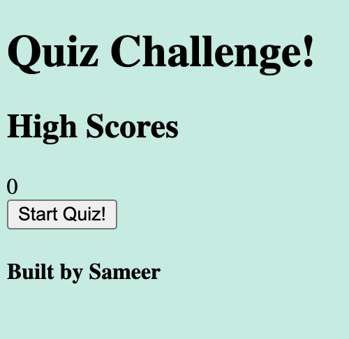

Module 04 Quiz Challenge

1. Press the start button to begin the timed quiz.

2. You will have 5 seconds to answer each question. 

3. Each question answered incorrectly will deduct 2 seconds from the timer.

4. When you complete the quiz and/or the time runs down to 0, the game will be over. 

5. You will be able to add your initials to the High Scores.

6. Have fun!

GitHub: https://github.com/sameersamuel/module-04_quiz-challenge.git